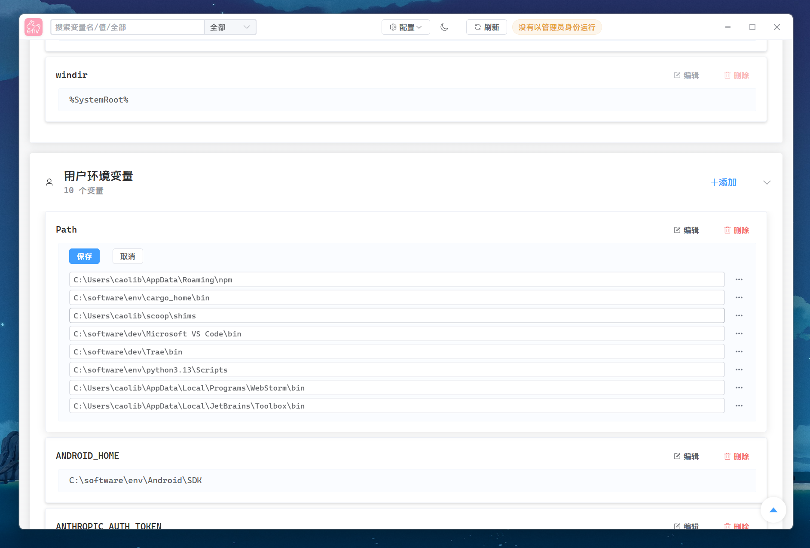

<h1 align="center">

</h1>

  

  
  
  
  

## 项目简介

wem 是一个 Windows 环境变量管理工具

## 免责声明

> [!warning]
> 
> 1. 使用前请先使用导出配置进行备份
> 2. 本项目为开源工具，旨在提升环境变量管理体验，使用前请自行评估风险。
> 3. 修改系统环境变量具有一定风险，操作请谨慎。
> 4. 作者及贡献者不对因使用本工具造成的任何数据丢失、系统异常等后果承担责任。
