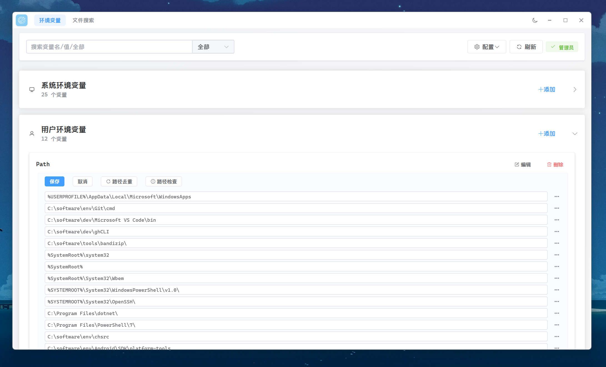
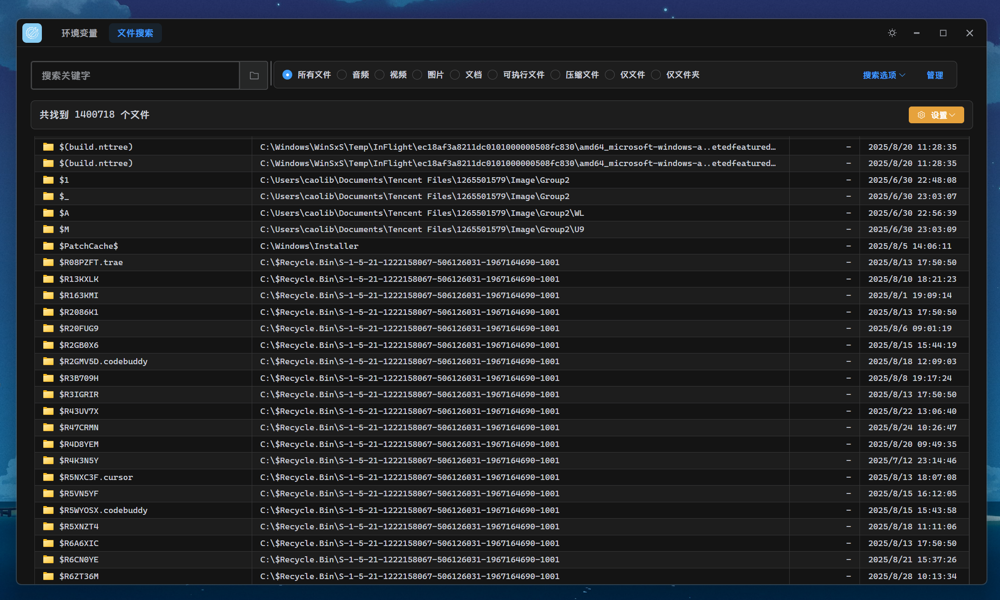
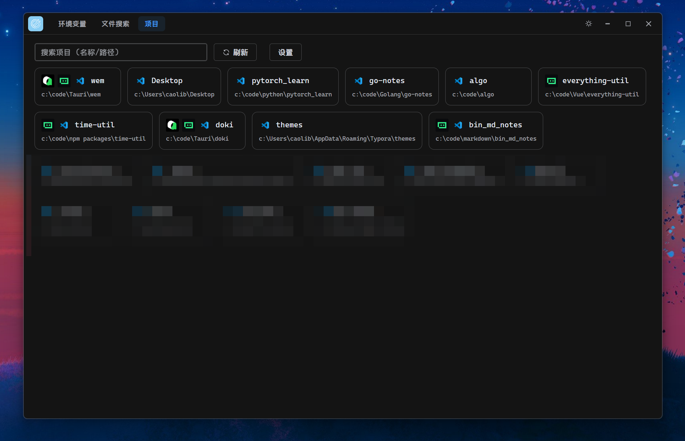

<h1 align="center">

</h1>

  

  
  
  
  

## 简介

我的工具合集，目前有：
- **Windows环境变量管理器**：图形化界面管理系统和用户环境变量，支持增删改查、路径检测以及去重、备份还原等功能。

- 本地文件搜索：基于本地everything http服务器的文件搜索功能

- 项目启动面板

## 免责声明

> [!warning]
> 
> 1. 使用前请先使用导出配置进行备份
> 2. 修改系统环境变量具有一定风险，操作请谨慎。
> 3. 作者不对因使用本工具造成的任何数据丢失、系统异常等后果承担责任。
