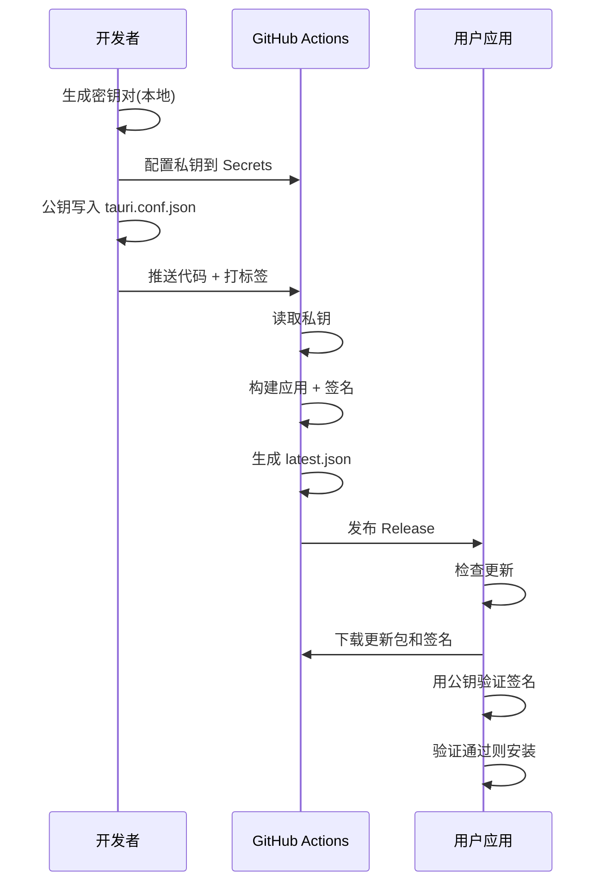

# 更新签名密钥安全指南

## 🔐 为什么需要签名?

Tauri 自动更新功能强制要求签名验证,这是为了:

1. **防止恶意更新** - 确保用户只会下载官方更新
2. **防止中间人攻击** - 即使下载链接被篡改也无法通过验证
3. **保证更新来源可信** - 只有持有私钥的人才能发布更新

## 🔑 密钥分工说明

### 私钥 (Secret Key)
- **文件**: `C:\Users\caolib\.tauri\my-tools.key`
- **内容**: 加密的私钥(348字符)
- **作用**: 在构建时签名更新包
- **保存位置**: 
  - ✅ 你的电脑(本地备份)
  - ✅ GitHub Secrets(CI/CD使用)
  - ❌ **永远不要提交到 Git!**
  - ❌ **永远不要公开分享!**

### 公钥 (Public Key)
- **文件**: `C:\Users\caolib\.tauri\my-tools.key.pub`
- **内容**: 公开的验证密钥
- **作用**: 打包到应用中,验证更新签名
- **保存位置**:
  - ✅ `tauri.conf.json` 中的 `updater.pubkey`
  - ✅ 可以提交到 Git
  - ✅ 可以公开分享

### 密码 (Password)
- **用途**: 保护私钥文件
- **保存位置**:
  - 🧠 记在你的脑子里!
  - ✅ GitHub Secrets(用于 CI/CD)
  - ❌ 不要写在代码里
  - ❌ 不要保存在不安全的地方

## 🔄 签名工作流程



## 🛡️ 安全最佳实践

### ✅ 必须做的

1. **立即备份私钥**
   ```powershell
   # 备份到加密的 U 盘或云存储(加密)
   Copy-Item "$env:USERPROFILE\.tauri\my-tools.key" "安全的备份位置"
   ```

2. **记住密码**
   - 使用密码管理器(如 1Password, BitWarden)
   - 或者写在物理笔记本上(不要拍照!)

3. **定期验证 GitHub Secrets**
   - 确保密钥配置正确
   - 测试构建流程

### ❌ 绝对不能做的

1. **不要提交私钥到 Git**
   ```gitignore
   # .gitignore 已经包含
   *.key
   .tauri/
   ```

2. **不要在公开场合展示私钥**
   - 不要截图包含私钥的终端
   - 不要复制到公开的聊天工具
   - 不要发送到不安全的邮箱

3. **不要使用弱密码**
   - 不要使用空密码
   - 不要使用简单密码(如 123456)

4. **不要多人共享私钥**
   - 如果团队协作,使用 GitHub 环境保护规则
   - 限制谁可以触发发布构建

## 🚨 私钥泄露怎么办?

如果私钥不慎泄露:

### 立即操作

1. **生成新密钥对**
   ```powershell
   pnpm tauri signer generate -w $env:USERPROFILE\.tauri\my-tools-new.key --force
   ```

2. **更新所有配置**
   - 更新 `tauri.conf.json` 中的公钥
   - 更新 GitHub Secrets 中的私钥和密码
   - 提交并发布新版本

3. **通知用户**
   - 旧版本应用将无法验证新签名
   - 用户需要重新下载完整安装包

### 为什么如此严重?

```
持有私钥的人可以:
✗ 发布冒充你的恶意更新
✗ 向用户推送病毒/木马
✗ 窃取用户数据
✗ 损害应用声誉
```

## 💡 为什么本地保存密钥?

### GitHub Actions 需要私钥

- GitHub Actions 在云端构建应用
- 需要私钥来签名更新包
- 通过 GitHub Secrets 安全传递

### 本地也需要保存

1. **备份安全** - GitHub Secrets 无法导出查看
2. **本地构建** - 本地测试发布版本时需要
3. **密钥轮换** - 本地文件是密钥的源头
4. **灾难恢复** - 如果 GitHub Secrets 误删,可以从本地恢复

### 为什么不能只存 GitHub?

❌ **风险场景:**
1. GitHub Secrets 不小心删除了
2. GitHub 账号被封禁或无法访问
3. 需要迁移到其他 CI/CD 平台
4. 需要生成新的密钥对进行轮换

如果只存在 GitHub Secrets 且丢失:
- ❌ 无法再发布更新
- ❌ 必须要求所有用户重新安装
- ❌ 失去更新控制权

## 📋 密钥管理清单

### 初次配置
- [ ] 生成密钥对
- [ ] 备份私钥到安全位置
- [ ] 记录密码到密码管理器
- [ ] 配置 GitHub Secrets
- [ ] 测试发布流程

### 日常维护
- [ ] 每月检查备份是否完整
- [ ] 每季度测试一次恢复流程
- [ ] 监控 GitHub Actions 构建日志
- [ ] 定期更新密码

### 团队协作
- [ ] 明确谁有权限访问私钥
- [ ] 使用 GitHub 环境保护规则
- [ ] 记录密钥使用日志
- [ ] 定期进行安全审计

## 🔗 相关文档

- [Tauri 更新器文档](https://v2.tauri.app/plugin/updater/)
- [GitHub Secrets 文档](https://docs.github.com/en/actions/security-guides/encrypted-secrets)
- [密码学最佳实践](https://cheatsheetseries.owasp.org/cheatsheets/Cryptographic_Storage_Cheat_Sheet.html)

## ⚡ 快速参考

### 生成新密钥
```powershell
pnpm tauri signer generate -w $env:USERPROFILE\.tauri\my-tools.key
```

### 查看公钥
```powershell
cat $env:USERPROFILE\.tauri\my-tools.key.pub
```

### 查看私钥(仅用于配置 GitHub)
```powershell
cat $env:USERPROFILE\.tauri\my-tools.key
```

### 验证配置
```powershell
.\scripts\verify-updater-keys.ps1
```

---

**记住: 私钥就像你家的钥匙,一旦丢失或被盗,后果严重!**
